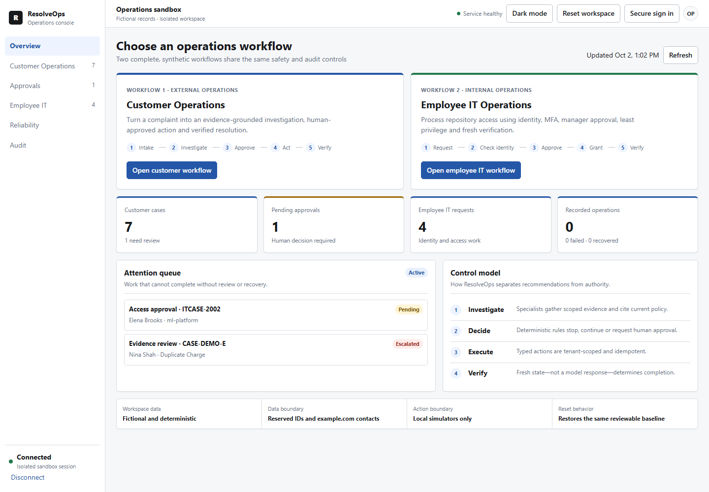
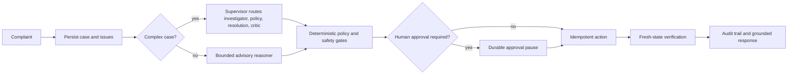
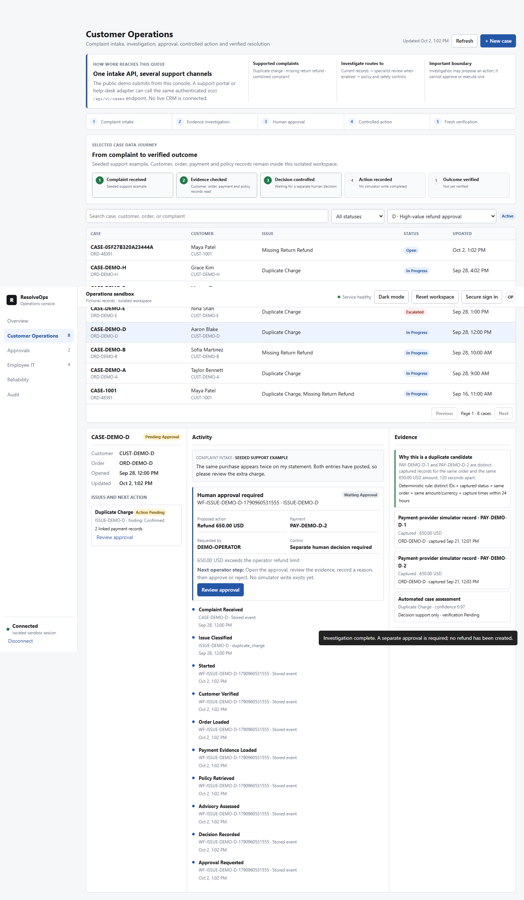

# ResolveOps

[](https://github.com/abhilashvadla98-pixel/resolveops/actions/workflows/ci.yml)

ResolveOps is a case-resolution service for customer-support and employee-IT teams. It connects an
incoming request to evidence, a controlled decision, an idempotent action and an independent read
of the resulting state. Complex customer cases use a five-role LangGraph investigation, but model
output stays advisory: deterministic code owns approvals, writes and verification.

The public demo opens with populated synthetic data and two distinct paths:

- **Customer Operations:** complaint intake → evidence investigation → human approval → controlled
  action → fresh verification.
- **Employee IT Operations:** access request → identity and MFA checks → manager approval →
  least-privilege grant → fresh verification.

[Open the synthetic demo](https://resolveops-demo.onrender.com/console) *(the free host may need about
one minute to wake)* · [watch the 42-second overview](https://github.com/abhilashvadla98-pixel/resolveops/releases/download/v1.0.0/resolveops-product-demo.webm)
· [watch the 72-second technical walkthrough](https://github.com/abhilashvadla98-pixel/resolveops/releases/download/v1.1.0/resolveops-technical-walkthrough.webm)

## Three-minute recruiter path

1. Open the demo. It creates an isolated workspace with fictional records; no login or key is
   required.
2. Select **Open customer workflow**, choose **D · High-value refund approval**, then select
   **Investigate**.
3. Read the evidence and proposed action. Select **Review approval**, record a reason and approve.
4. Confirm that the case is **Resolved**, the action is **Verified**, and the five-stage data
   journey is complete.
5. Open **Reliability** to inspect the persisted attempt and verification. Then open **Employee IT**
   and select `ITCASE-2004` to see missing MFA stop an access request.

Every payment, directory, repository and ticket interaction in the public demo uses a local
simulator. The interface never claims that a real bank transfer or repository grant occurred.



## Flagship workflow



The same control pattern supports employee repository-access requests: identity, employment, MFA,
team, manager approval, directory membership, Git account, repository ownership, action, and fresh
verification are all checked independently.

## Customer workflow: complaint to verified outcome

Complaints can arrive through the console or the authenticated intake API used by a support-portal
or help-desk adapter. The separate signed event endpoint accepts later refund-status updates; it is
not a complaint-intake path. The demo queue is preloaded so the complete flow is reviewable without connecting a CRM.
The selected-case panel shows where the complaint came from and how its customer, order, payment
and policy records stay connected.

### 1. Investigate, then stop for approval

A sensitive refund pauses durably and shows the proposed amount, payment, reason and authority
boundary before an operator can approve or reject it. The investigation cannot move money.



### 2. Execute once and verify from fresh state

After approval, the control plane records one simulated refund using an idempotency key. It then
reads the payment-provider simulator independently; only a matching read marks the case resolved.
The UI retains the policy citations, ordered timeline and draft customer response.


### 3. Inspect operational evidence

The reliability view exposes the persisted attempt, latency and verification events instead of
reducing the run to a chat response.


## Employee workflow: request to least-privilege access

The separate internal flow checks employment, identity, MFA, manager approval, group membership,
repository ownership and the final permission. `ITCASE-2002` demonstrates the approval pause;
`ITCASE-2004` demonstrates the missing-MFA safety stop. Unsafe requests fail closed and create no
grant.


See the [click-by-click demo guide](docs/DEMO_WALKTHROUGH.md) for both complete paths.

## Measured evidence

| Evidence | Recorded result | What it proves |
|---|---:|---|
| Customer workflow regression | 24/24 | Real workflow, persistence, approvals, actions and verification |
| Employee IT regression | 14/14 | Access controls, idempotency and partial-state handling |
| Offline multi-agent trajectories | 22/22 | Five-role routing, tools, critic, replanning and budgets |
| Adversarial security set | 17/17 | Known injection and unsafe-request patterns are rejected |
| Live single-reasoner Gemini check | 3/3 | Provider integration worked for that dated run |
| Reviewed-memory ablation | 8 paired cases | Tenant/policy-scoped memory path and token/routing comparison |
| Human response review | 0/24 | Owner labels are intentionally still pending |
| Demo data contract | 325 connected records | Repeatable customer, payment, return, IT, approval and audit state |
| Public demo isolation | 2 independent sessions | A write in one visitor workspace was absent from the other |

See [docs/EVALUATION.md](docs/EVALUATION.md) for datasets, checksums, commands and limitations.
The 10-task × 3-trial live multi-agent runner and its dated failure report are retained as evidence;
provider failures are not recast as model-quality passes. Unknown pricing remains `null` rather
than being invented.

## Quick start

Requirements: Python 3.12. Docker is optional.

```powershell
python -m venv .venv
.\.venv\Scripts\python.exe -m pip install -e ".[dev]"
Copy-Item .env.example .env
.\.venv\Scripts\python.exe -m uvicorn resolveops.api.main:app --host 127.0.0.1 --port 8000
```

Open `http://127.0.0.1:8000/console`. The isolated fictional workspace loads automatically. The
complete deterministic demo needs no paid service or model key.

Run the required checks:

```powershell
.\.venv\Scripts\python.exe -m pytest -q
.\.venv\Scripts\ruff.exe check .
.\.venv\Scripts\mypy.exe src
.\.venv\Scripts\python.exe scripts/run_agent_evaluation.py
.\.venv\Scripts\python.exe scripts/run_memory_ablation.py
```

## Safety boundaries

- Models can plan, investigate, cite policy, propose and criticize; they cannot approve or write.
- Tools are typed, role-allowlisted and tenant-scoped.
- Sensitive actions require deterministic RBAC, state, amount, policy and idempotency checks.
- Approval resumes a persisted workflow; page refreshes and retries do not duplicate the action.
- Completion is reported only after a fresh read verifies the expected state.
- Reviewed memory is advisory, expires, remains tenant-scoped and must match current policy versions.
- Retrieved case, policy and memory text is always treated as untrusted data.

## Tradeoffs

- Five-role analysis costs more than one reasoning call, so only complex cases route through it.
- SQLite makes the local demo easy; PostgreSQL is the production persistence target.
- Hybrid retrieval remains in process for the small policy corpus; measured pgvector evidence shows
  the scale-up path.
- The MCP consumer is a small read-only case lookup with local fallback only on availability
  failure. Security denial never falls back.
- Redis improves worker coordination but PostgreSQL remains the durable source of truth.

## Current limitations

- The synthetic demo is deployed on Render. It is a single-instance, free-tier demonstration, not
  a production service or an availability claim.
- `infra/terraform` is an unprovisioned AWS reference design; no AWS resources are claimed.
- The exposed Gemini credential must remain revoked. Its replacement is kept only in ignored local
  secret storage and is never included in public demo configuration.
- The owner must manually label all 24 response-review rows; labels are never generated by code.
- One genuine owner correction completed the reviewed feedback loop in dataset v1.0.0; the focused
  browser regression proves failed agent validation blocks approval. See
  [the case study](docs/CASE_STUDY.md#closed-owner-feedback-loop).
- The first 30-trial live multi-agent run completed with 0 passes: strict evidence/policy validation
  stopped seven trajectories and provider failures stopped 23. It is retained as failure evidence,
  not presented as model-quality proof.
- No live payment, CRM, identity, Git, ticketing or settlement vendor is connected. All checked-in
  business data is synthetic.
- Local measurements are not production SLOs, and the recorded 3/3 provider result is not a general
  model-quality claim.

## Documentation

- [Architecture and agent control](docs/MULTI_AGENT_ARCHITECTURE.md)
- [Evaluation methodology](docs/EVALUATION.md)
- [Engineering case study](docs/CASE_STUDY.md)
- [Operator console](docs/OPERATOR_CONSOLE.md)
- [Security and threat model](docs/SECURITY.md)
- [Deployment and reference infrastructure](docs/DEPLOYMENT.md)
- [Safe public demo runbook](docs/PUBLIC_DEMO.md)
- [Operations and recovery](docs/OPERATIONS_RUNBOOK.md)
- [Cost and latency](docs/COST_ANALYSIS.md)
- [Demo walkthrough](docs/DEMO_WALKTHROUGH.md)

## License

MIT. See [LICENSE](LICENSE).
