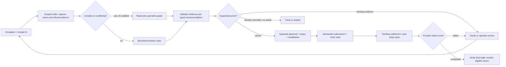

# ResolveOps

[](https://github.com/abhilashvadla98-pixel/resolveops/actions/workflows/ci.yml)

ResolveOps investigates customer billing complaints and processes employee repository-access
requests. Evidence supports a proposal; authorized people approve it; deterministic code executes
and verifies the result. An accepted refund request is **not** a completed refund.

[Synthetic demo](https://resolveops-demo.onrender.com/console) ·
[Workflow guide](docs/DEMO_WALKTHROUGH.md) · [Release status](docs/RELEASE_GATES.md)

The public sandbox uses fictional records and local provider simulators. Its configuration disables
live AI calls. The October 4 repairs described below are local changes until deployment is verified;
the public link may still show the previous build.

## Two bounded workflows

**Customer Operations:** enter a duplicate-charge or missing-return-refund complaint. ResolveOps
reads payment obligations, captures, returned items and prior refunds. It proposes an eligible
refund, tracks an existing refund, explains a no-action result, or stops for review. Approval submits
one simulated refund. A later provider event determines settlement or failure.

**Employee IT:** submit a repository and permission request. Rules check employment, identity, MFA,
team, the actual manager's approval and current access. The service applies the allowed grant and
reads back directory membership and repository permission. This path is not an LLM agent.
Demo manager decisions are explicitly labeled simulations.

## Flagship: keep the case open until settlement



Two equal-looking charges are only a candidate. Automatic duplicate handling requires two full
captures of the same explicit payable obligation, a matching order total and currency, active policy
and no prior refund covering that obligation. Split captures, unknown obligations and overlapping
returns stop automatic action. The server chooses the eligible capture and calculates the amount;
the browser and model cannot supply their own financial authority.

In live mode, the graph has supervisor, investigator, policy, resolution and critic roles. Later
roles are skipped after an evidence or policy safety stop. This is a bounded sequence with conditional
stops, not a general autonomous supervisor. Simple cases do not need model calls.

## Try the repaired flow locally

1. Open **Customer Operations → New case**. Use `CUST-DEMO-A`, `ORD-DEMO-A` and
   “I was charged twice for this order.”
2. Select **Investigate**. Inspect the obligation, exact capture, amount and policy. No refund exists yet.
3. Select **Review approval**, enter a reason and approve using the explicitly simulated reviewer.
4. Expect **Refund submitted; settlement pending**. The case remains open.
5. Select **Simulate settlement success**. Only then should the issue resolve. Repeat in a fresh
   workspace with **Simulate settlement failure** to see the recovery path.
6. Open **Employee IT → New access request** for the requester/manager/provisioning journey.

See the [illustrated guide](docs/DEMO_WALKTHROUGH.md) for both workflows. The existing
[42-second teaser](https://github.com/abhilashvadla98-pixel/resolveops/releases/download/v1.0.0/resolveops-product-demo.webm)
and [72-second recording](https://github.com/abhilashvadla98-pixel/resolveops/releases/download/v1.1.0/resolveops-technical-walkthrough.webm)
show an earlier release, not the repaired settlement lifecycle or current live-agent behavior.

## Measured evidence

| Check | Evidence | Scope |
|---|---|---|
| Customer regression | [24-case v2 report](evals/workflows/settlement-v2-report.json) | Actual workflow and persisted issue/refund state; scripted, not live AI |
| New-request browser journeys | [Customer tests](tests/test_customer_journey_browser.py), [IT tests](tests/test_employee_it_browser.py) | Intake, approval, pending, settlement/failure and grant verification |
| Integrated agent evaluation | [Ten tasks](evals/integrated/cases.jsonl), [runner](scripts/run_integrated_agent_evaluation.py) | Application read tools and business outcomes; expectations excluded from model input |
| Grounding and control | [Grounding tests](tests/test_agent_grounding.py), [workflow tests](tests/test_workflows.py) | Fabricated observations, altered actions and unsupported recommendations stop safely |
| Combined complaint | [Two settlement-order tests](tests/test_combined_customer_journey.py) | Duplicate capture plus partial return; no repeat refund; both final events required |
| Human review | [Evaluation guide](docs/EVALUATION.md) | 24 owner labels remain pending; code does not invent them |

Rules-only repeats are deterministic regressions, not a stochastic benchmark. Historical provider
contract tests used simulated tools and are labeled accordingly. Failures remain in immutable
reports. Unknown token usage or pricing stays unknown. See [evaluation methodology](docs/EVALUATION.md)
for provenance and current live results.

## Quick start

Python 3.12 is required. Docker is optional for the disposable local sandbox.

```powershell
python -m venv .venv
.\.venv\Scripts\python.exe -m pip install -e ".[dev,interfaces,llm,workflow]"
.\.venv\Scripts\python.exe scripts/run_demo.py
```

Open `http://127.0.0.1:8000/console`. This loopback-only shared sandbox creates a temporary database,
ignores existing secrets and disables model calls. Its activity is discarded when stopped; restart
the same command after reboot. Use `--port 8001` if 8000 is occupied. For an existing database,
follow the [deployment runbook](docs/DEPLOYMENT.md); do not
replace unknown payment obligations with guesses.

```powershell
.\.venv\Scripts\python.exe -m pytest -q
.\.venv\Scripts\ruff.exe check .
.\.venv\Scripts\mypy.exe src
.\.venv\Scripts\python.exe scripts/run_integrated_agent_evaluation.py --mode rules_only
```

## Tradeoffs and limits

- No live bank, CRM, identity-provider or Git-host write is connected. An operator enters customer
  messages through an authenticated API. Customer authentication and email/CRM delivery are not implemented.
- Supported complaints are duplicate charges and missing return refunds. Arbitrary disputes and
  complex capture allocations require manual review.
- Separate human roles are enforced outside the sandbox. Demo role switching is not a real manager
  decision. Delegated manager authority is not supported.
- Reviewed memory is typed, tenant/policy scoped and expiring. Neither its quality benefit nor
  multi-role superiority over one investigator is established by a live controlled comparison.
- SQLite keeps the demo small. PostgreSQL supplies durable checkpoints and row locking. A free,
  single-instance Render demo is not a production availability claim.
- AWS Terraform is reference infrastructure, not an AWS deployment. CI and deployed checks must
  pass for the exact release commit before new capabilities are described as deployed.
- Live inference requires a rotated credential in ignored local storage. Never reuse the exposed key.

## Engineering notes

[Architecture](docs/MULTI_AGENT_ARCHITECTURE.md) · [Audit](docs/WORKFLOW_DESIGN_AUDIT.md) ·
[Evaluation](docs/EVALUATION.md) · [Security](docs/SECURITY.md) ·
[Operations](docs/OPERATIONS_RUNBOOK.md) · [Deployment](docs/DEPLOYMENT.md) ·
[Cost](docs/COST_ANALYSIS.md) · [Feedback case study](docs/CASE_STUDY.md)

MIT licensed. See [LICENSE](LICENSE).
