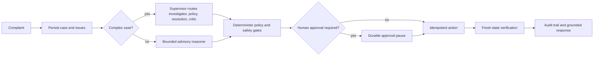

# ResolveOps

[](https://github.com/abhilashvadla98-pixel/resolveops/actions/workflows/ci.yml)

ResolveOps is an operations system that investigates customer and employee cases, grounds advice in
versioned evidence, pauses sensitive changes for approval, executes idempotently, and verifies the
new state. Complex customer cases automatically use a five-role LangGraph investigation; model
output remains advisory and deterministic code keeps action authority.

[Live synthetic demo](https://resolveops-demo.onrender.com/console) *(free host: allow about one minute for the first wake-up)*
· [42-second product teaser](https://github.com/abhilashvadla98-pixel/resolveops/releases/download/recruiter-demo-v1/resolveops-recruiter-demo.webm)
· [evaluation evidence](docs/EVALUATION.md) · [engineering case study](docs/CASE_STUDY.md)
· [public-demo deployment](docs/PUBLIC_DEMO.md)

## Flagship workflow



The same control pattern supports employee repository-access requests: identity, employment, MFA,
team, manager approval, directory membership, Git account, repository ownership, action, and fresh
verification are all checked independently.

## Measured evidence

| Evidence | Recorded result | What it proves |
|---|---:|---|
| Customer workflow regression | 24/24 | Real workflow, persistence, approvals, actions and verification |
| Employee IT regression | 14/14 | Access controls, idempotency and partial-state handling |
| Offline multi-agent trajectories | 22/22 | Five-role routing, tools, critic, replanning and budgets |
| Adversarial security set | 17/17 | Known injection and unsafe-request patterns are rejected |
| Live single-reasoner Gemini check | 3/3 | Provider integration worked for that recorded run |
| Reviewed-memory ablation | 8 paired cases | Tenant/policy-scoped memory path and token/routing comparison |
| Human response review | 0/24 | Owner labels are intentionally still pending |
| Demo data contract | 325 connected records | Repeatable customer, payment, return, IT, approval and audit state |

See [docs/EVALUATION.md](docs/EVALUATION.md) for datasets, checksums, commands and limitations.
The 10-task × 3-trial live multi-agent runner is included but must not run until the exposed demo
credential is rotated. Unknown pricing remains `null`; the project never invents cost.

## Quick start

Requirements: Python 3.12. Docker is optional.

```powershell
python -m venv .venv
.\.venv\Scripts\python.exe -m pip install -e ".[dev]"
Copy-Item .env.example .env
.\.venv\Scripts\python.exe -m uvicorn resolveops.api.main:app --host 127.0.0.1 --port 8000
```

Open `http://127.0.0.1:8000/console`, choose **Open workspace**, and use the isolated fictional
workspace. The complete deterministic demo needs no paid service or model key.

Run the required checks:

```powershell
.\.venv\Scripts\python.exe -m pytest -q
.\.venv\Scripts\ruff.exe check .
.\.venv\Scripts\mypy.exe src
.\.venv\Scripts\python.exe scripts/run_agent_evaluation.py
.\.venv\Scripts\python.exe scripts/run_memory_ablation.py
```

## Safety boundaries

- Models can plan, investigate, cite policy, propose and criticize; they cannot approve or write.
- Tools are typed, role-allowlisted and tenant-scoped.
- Sensitive actions require deterministic RBAC, state, amount, policy and idempotency checks.
- Approval resumes a persisted workflow; page refreshes and retries do not duplicate the action.
- Completion is reported only after a fresh read verifies the expected state.
- Reviewed memory is advisory, expires, remains tenant-scoped and must match current policy versions.
- Retrieved case, policy and memory text is always treated as untrusted data.

## Tradeoffs

- Five-role analysis costs more than one reasoning call, so only complex cases route through it.
- SQLite makes the local demo easy; PostgreSQL is the production persistence target.
- Hybrid retrieval remains in process for the small policy corpus; measured pgvector evidence shows
  the scale-up path.
- The MCP consumer is a small read-only case lookup with local fallback only on availability
  failure. Security denial never falls back.
- Redis improves worker coordination but PostgreSQL remains the durable source of truth.

## Current limitations

- No public cloud environment is deployed. `infra/aws` is reference Terraform, not evidence of an
  AWS deployment.
- The previously used Gemini credential was exposed outside local secret storage. Rotate it before
  enabling integrated agents, running live multi-agent evaluation, or publishing a public demo.
- The owner must manually label all 24 response-review rows; labels are never generated by code.
- The owner-feedback promotion pipeline is implemented, but no genuine correction is claimed as a
  closed learning loop until a reviewed owner example is promoted and its regression test passes.
- No live payment, CRM, identity, Git, ticketing or settlement vendor is connected. All checked-in
  business data is synthetic.
- Local measurements are not production SLOs, and the recorded 3/3 provider result is not a general
  model-quality claim.

## Documentation

- [Architecture and agent control](docs/MULTI_AGENT_ARCHITECTURE.md)
- [Evaluation methodology](docs/EVALUATION.md)
- [Operator console](docs/OPERATOR_CONSOLE.md)
- [Security and threat model](docs/SECURITY.md)
- [Deployment and reference infrastructure](docs/DEPLOYMENT.md)
- [Safe public demo runbook](docs/PUBLIC_DEMO.md)
- [Operations and recovery](docs/OPERATIONS_RUNBOOK.md)
- [Cost and latency](docs/COST_ANALYSIS.md)
- [Demo script](docs/DEMO_SCRIPT.md)

## License

MIT. See [LICENSE](LICENSE).
