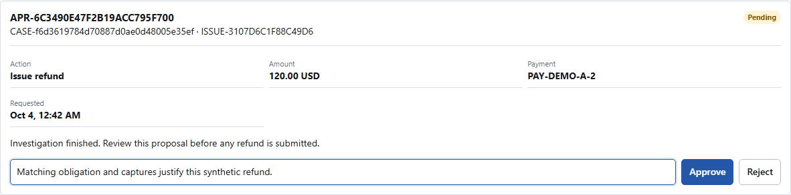
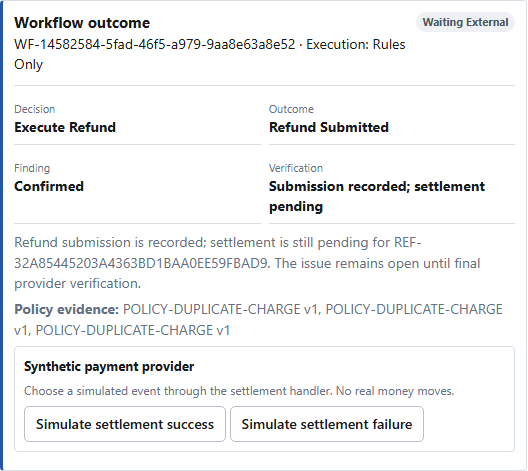
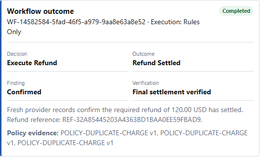
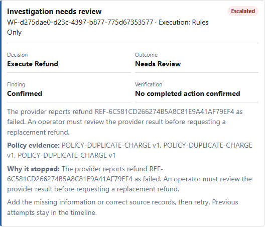
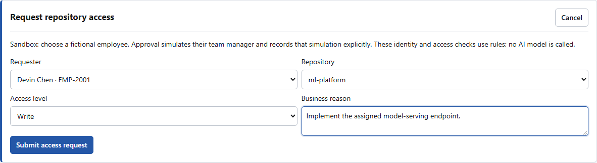
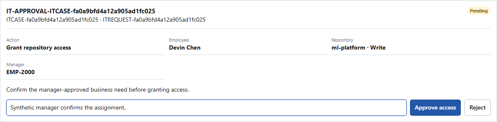
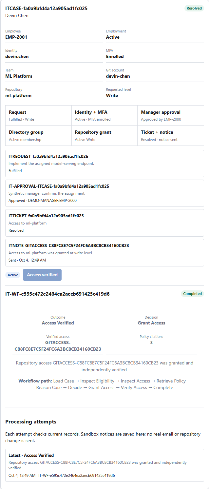

# ResolveOps demo walkthrough

Two workflows share one console: customer refund complaints and employee repository access.
All business records, money movement, access grants and notices in the sandbox are synthetic.
No bank, CRM, directory or Git provider is changed.

This guide describes **version 1.2.0**, tested locally on **2026-10-04**. Check the
[deployment record](PUBLIC_DEMO.md) and `/health/build` before using the
[public demo](https://resolveops-demo.onrender.com/console) as release evidence. A sleeping free
instance can take time to start. The repository quick start also runs the same synthetic workflow
locally. Open /console and wait until the workspace is connected.

## Customer Operations: complaint to settled refund

Use one complaint throughout. Do not investigate several cases for the same order merely to make
the demonstration busier.

1. Select **Open customer workflow**, then **+ New case**.
2. Enter customer CUST-DEMO-A, order ORD-DEMO-A and “I was charged twice for this order.” Select
   **Create case**. These are fictional records already in the sandbox. This is operator-assisted
   intake, not a live customer portal.
3. The new case stores the complaint and a rule-based classification. Intake does not confirm a
   duplicate charge, approve anything or create a refund. A support portal or help-desk adapter
   could use the same authenticated intake API; none is connected in this demo.
4. Select **Investigate**. The workflow rereads customer, order, payment and current policy records.
   Similar amounts or capture times alone do not prove a duplicate: trusted evidence must link two
   full captures to the same payable obligation. Missing or ambiguous evidence stops the action.
5. Review the proposed payment, amount, currency and policy evidence. The execution label identifies
   the mode for this run. **Rules Only** is not evidence that a live model ran. A configured
   specialist investigation can advise, but cannot authorize money movement.
6. Expect **Review the refund proposal**, including for this lower-value case. Confirm **No refund
   has been submitted**, then select **Review approval**.
7. Inspect the exact payment and amount. Enter a reason, then **Approve** or **Reject**. The sandbox
   explicitly simulates a separate approver; it is not a real financial approval. Approval rechecks
   current evidence and deterministic controls before one idempotent simulator write.
8. After approval, expect **Refund Submitted** and **Settlement is still pending**. The case remains
   in progress. A fresh read confirms the pending refund record, not settled money.
9. Select **Simulate settlement success**. A synthetic event passes through the settlement handler.
   Only completed refund state and fresh verification produce **Refund Settled**, **Final
   settlement verified** and a resolved case. The customer response is a draft for operator review;
   no real email is sent.

The seeded **D · High-value refund approval** scenario shows the same approval boundary with a
650 USD proposal, without creating a new case.

### Compare the three checkpoints

**Approval:** the target is PAY-DEMO-A-2 for 120 USD, not an amount chosen by the browser.
The note and decision are recorded separately from investigation.

**After approval:** the refund exists but settlement is pending. The visible execution mode is
Rules Only. The two buttons simulate provider events; they do not move real money.

**After successful settlement:** the fresh read confirms the final outcome. This is the first
point at which this refund is reported as settled.

### Show one safety path

Use a fresh/reset sandbox, repeat the complaint-to-approval path, and choose **Simulate settlement
failure**. The case becomes escalated and explains that the provider reported a failure. An operator
must review it; the response must not say the customer received the refund. Demo controls cannot
replace a final outcome with the opposite outcome.

Alternatively, scenario E shows an authorization hold: no second captured charge means no refund
is needed.

Retry an escalated investigation only after correcting source records or supplying missing
information. Earlier attempts remain in the timeline. A timeout means the client does not know
the result: refresh and reconcile stored state before trying again.

For a confirmed **failed or cancelled** refund, a new investigation can propose a replacement.
It requires a new approval and a new attempt-specific request ID. Repeating that same new request
still creates only one refund. Pending or unknown outcomes do not permit a blind retry, and late
events for the old attempt cannot resolve or reopen the replacement attempt.

## Employee IT Operations: request to verified access

This path uses deterministic identity and access checks. It does not call an AI model.

1. Return to **Overview**, open **Employee IT Operations**, and select **New access request**.
2. Choose fictional employee EMP-2001, the ML Platform repository and **Write**. Enter “Implement
   the assigned model-serving endpoint.” The form labels employee selection as a sandbox simulation.
   Outside the demo, the authenticated identity determines the requester.
3. Submit. ResolveOps saves a request, case and ticket; no access is granted. The same receipt and
   content return the same request on a repeated submission.
4. Select **Review approval**. Check employee, repository, access level and manager, enter a reason,
   and select **Approve access**. The sandbox records DEMO-MANAGER:EMP-2000. In a normal session,
   an active, MFA-enabled identity must map to the actual current manager. An unrelated approver
   role or self-approval is not enough.
5. Select **Run safety checks and process**. The workflow rechecks employment, identity, MFA, team
   membership, manager approval, policy and existing access. Only read/write access is supported.
   Conflicting, inactive or partial access stops for reconciliation.
6. Inspect **Access Verified**, directory membership, repository permission, ticket and saved
   synthetic notice. A fresh read verifies the result. **Processing attempts** retains prior
   attempts and labels the newest result, including after refresh.

**Request:** select a fictional employee only in the sandbox; the form states that no AI model
is called for this access workflow.

**Approval:** review the actual target repository, access level and manager before processing.

**Verification:** the final view retains the explicit simulated manager, fresh access result
and newest processing attempt. Notices are saved records, not real email.

Select ITCASE-2004 to show missing MFA stopping processing without a grant. A genuine correction to
source records can permit a new attempt without erasing the failed one. Reset before repeating the
fresh-request walkthrough.

## Audit, evidence and limits

Open **Reliability** for recorded attempts and measured duration. Open **Audit** for actors,
decisions and outcomes. These are synthetic-system measurements, not external-provider performance.
An operator correction remains pending human review; it does not automatically become a trusted
label, policy or case outcome.

- Real application behavior: authenticated APIs, persistence, tenant scoping, approval records,
  idempotency, deterministic authorization, fresh reads and audit history.
- Simulated business systems: customer/payment records, settlement events, directory/repository
  changes, tickets and notices.
- Conditional: live specialist reasoning requires an enabled provider and a replacement credential.
  Browser tests disable provider calls. Show a saved trace from the same run before describing a
  demonstration as live multi-agent execution.

**Reset workspace** removes this session’s synthetic activity and restores its baseline. It does
not deploy code or repair a real external system.

## Media status

The [63.2-second local workflow recording](https://github.com/abhilashvadla98-pixel/resolveops/releases/download/v1.2.0/resolveops-workflow-repair-20261004.webm)
starts after the workspace loads and shows
new customer intake, approval, pending settlement, success, failed settlement on a separate order,
employee request/manager approval/verification, an MFA safety stop and audit history. Captions
explicitly identify rules-only execution and synthetic systems. It contains no live-agent trace
or external-provider action. The separate live evaluation report on the release page records
one real model-backed success and one quota failure; it is not part of this rules-only recording.

The [existing technical recording](https://github.com/abhilashvadla98-pixel/resolveops/releases/download/v1.1.0/resolveops-technical-walkthrough.webm)
and images outside the dated workflow-repair folder are historical media from an earlier build.
Do not use them as proof of the updated intake, separate approval and settlement sequence.

The screenshots above were captured from local browser tests on 2026-10-04, visually inspected,
and copied into a dated asset folder. Original outputs remain in the ignored artifacts directory.
They are not evidence of the deployed version or live model execution.
See [Operator console](OPERATOR_CONSOLE.md) for capture commands and test coverage.
