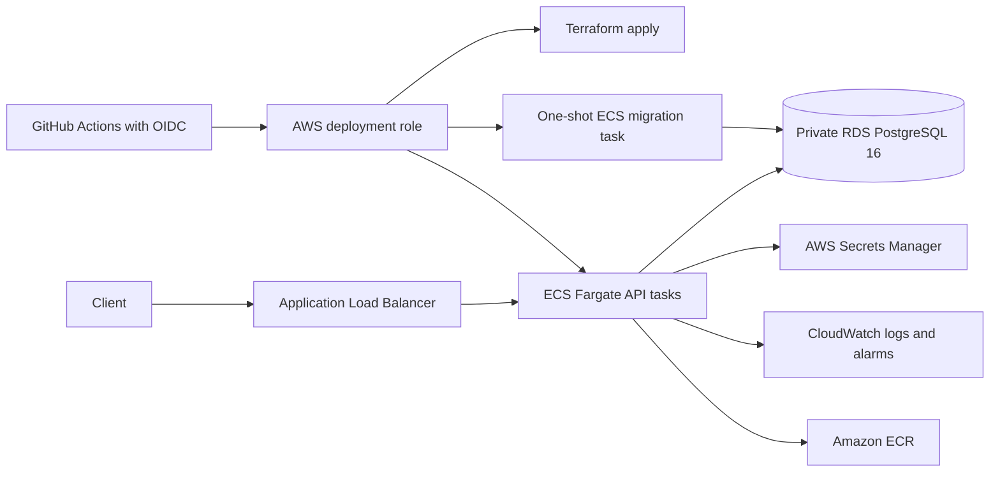

# ResolveOps deployment

## What Packet 16 provides

ResolveOps now has one tested container image, a local PostgreSQL Compose stack, CI checks, a manual
AWS deployment workflow, Terraform for the application infrastructure, and a deployment verifier.
The repository has not been connected to an AWS account, so this is a locally verified deployment
implementation—not a claim that a public cloud environment already exists.

## Deployment architecture



The load balancer is in two public subnets. API tasks and RDS are in two private subnets. A NAT
gateway lets private tasks pull images, read secrets, and send logs. Security groups permit public
HTTP/HTTPS only to the load balancer, load-balancer traffic only to API port 8000, and PostgreSQL
only from the ECS tasks. RDS is encrypted, not publicly accessible, keeps seven days of backups,
uses an AWS-managed master password, and enables deletion protection by default.

The checked-in defaults use one NAT gateway and a single-AZ small RDS instance to limit a portfolio
environment's cost. That creates availability limitations. A production review should choose
multi-AZ RDS and either a NAT gateway per Availability Zone or the needed VPC endpoints. ALB, NAT,
RDS, Fargate, logs, data transfer, and public IPv4 resources can all incur charges; review the AWS
calculator and destroy unused non-production infrastructure deliberately.

## Local Docker deployment

Copy `compose.env.example` to `.env.compose`, replace every placeholder, and then run:

```powershell
docker compose --env-file .env.compose config --quiet
docker compose --env-file .env.compose up --build -d database migrate api
python scripts/verify_deployment.py --base-url http://127.0.0.1:8000
```

The `migrate` container must finish successfully before the API starts. The API readiness endpoint
checks both database connectivity and the exact Alembic revision. The optional repeatable sample is:

```powershell
docker compose --env-file .env.compose --profile demo run --rm seed
```

Stop the stack without deleting PostgreSQL data:

```powershell
docker compose --env-file .env.compose down
```

Add `--volumes` only when you intentionally want to delete the local Compose database.

## Container controls

The multi-stage image installs a built wheel and leaves build files out of the runtime layer. The
runtime container:

- runs as numeric user `10001`, not root;
- uses a read-only root filesystem in Compose and ECS;
- drops all Linux capabilities in Compose;
- enables `no-new-privileges` in Compose;
- stores no credentials or `.env` files in the image;
- contains migrations and versioned domain policies;
- enforces the configured request-size and process-local rate limits;
- exposes authenticated Prometheus-compatible metrics at `/metrics` for operations roles;
- does not trust forwarded client addresses from every source; and
- exposes liveness at `/health/live` and migration-aware readiness at `/health/ready`.

The base image and dependencies are reproducibly recorded by the Docker build output and Terraform
provider lock file. Dependabot is configured for Python, Docker, GitHub Actions, and Terraform.

## CI/CD behavior

`.github/workflows/ci.yml` runs four independent gates:

1. lint, format, strict typing, local tests, both workflow evaluations, and dependency consistency;
2. the real PostgreSQL integration test;
3. a full Docker Compose migration/API deployment and external health verification;
4. Terraform formatting, initialization, and validation.

`.github/workflows/deploy-aws.yml` is manual and uses a protected GitHub environment. It obtains
short-lived AWS credentials through GitHub OIDC—no long-lived AWS access key is stored. Its order is
deliberate:

1. apply infrastructure with the API service stopped;
2. build and push an immutable commit-SHA image to ECR;
3. run the migration task and require exit code zero;
4. update the API service only after migration succeeds;
5. wait for ECS stability and run the public deployment verifier.

If migration fails, the API deployment does not continue. Existing healthy tasks are not replaced.
The ECS deployment circuit breaker rolls back a failed service deployment.

## AWS prerequisites requiring the account owner

These steps cannot be completed without the user's AWS and GitHub accounts:

1. Choose the AWS account, region, environment names, and spending limits.
2. Create an encrypted, versioned S3 Terraform-state bucket and a DynamoDB lock table.
3. Configure GitHub's OIDC provider and a least-privilege deployment role whose trust policy is
   restricted to this repository and the selected GitHub environments.
4. Create an application secret in AWS Secrets Manager with two JSON keys:
   `api_key_identities_json` and `webhook_secret`. Store API-key hashes, never plaintext API keys.
5. Optionally request/validate an ACM certificate and configure DNS before public use.
6. Add the following GitHub environment variables for `staging` or `production`:

   - `AWS_REGION`
   - `AWS_DEPLOY_ROLE_ARN`
   - `TF_STATE_BUCKET`
   - `TF_STATE_KEY`
   - `TF_LOCK_TABLE`
   - `APPLICATION_SECRET_ARN`
   - `CERTIFICATE_ARN` when HTTPS is enabled

No repository secret needs an AWS access key. `APPLICATION_SECRET_ARN` is an identifier; the secret
value remains in Secrets Manager.

## Terraform commands

Use a reviewed copy of `infra/terraform/terraform.tfvars.example`. Initialize remote state, format,
validate, and review a saved plan before applying:

```powershell
terraform -chdir=infra/terraform init `
  -backend-config="bucket=YOUR_STATE_BUCKET" `
  -backend-config="key=resolveops/production.tfstate" `
  -backend-config="region=YOUR_REGION" `
  -backend-config="dynamodb_table=YOUR_LOCK_TABLE" `
  -backend-config="encrypt=true"
terraform -chdir=infra/terraform fmt -check -recursive
terraform -chdir=infra/terraform validate
terraform -chdir=infra/terraform plan -out=deployment.tfplan
terraform -chdir=infra/terraform apply deployment.tfplan
```

Do not use a production apply merely to test syntax. CI and local validation use
`terraform init -backend=false` and make no AWS changes.

## Health and deployment verification

The application image includes the no-build operator console and serves it from `/console`. Verify
that the page, `/console/app.css`, and `/console/app.js` load from the same origin after deployment.
The console still requires a configured operations identity before it reads protected data or metrics.
Do not put an API key in an image, Compose file, screenshot, URL, or repository.

- `/health` remains the original compatibility endpoint.
- `/health/live` proves the process can answer HTTP without depending on the database.
- `/health/ready` verifies every configured tenant database is reachable and at revision
  `0008_employee_it_domain`. It returns 503 without exposing a tenant ID or database error.
- `scripts/verify_deployment.py` checks liveness, readiness, and the OpenAPI document with retries.

After deployment, also inspect the ECS deployment, target health, migration task exit code,
CloudWatch logs, RDS alarms, and ECR scan findings. Health success alone is not a complete security
or business-function test.

## Rollback and recovery

Application rollback means updating the ECS service to a previously known-good immutable task
definition. Database rollback is different: do not automatically downgrade after a new application
has written data. Use a reviewed forward-fix migration or a separately tested recovery plan.

Terraform lifecycle rules intentionally ignore the ECS service's task-definition and desired-count
changes because the deployment workflow owns those two fields after migrations succeed. Terraform
continues to own the task definitions and the rest of the infrastructure.

RDS deletion protection and a final snapshot are enabled by default. Removing the environment
requires an explicit reviewed change; Terraform should not be forced through those safeguards.

## Current limitations

- No real AWS resources, DNS records, certificate, GitHub environment, OIDC role, or remote state
  were created during Packet 16.
- Terraform manages one tenant database. The application supports multiple database-per-tenant
  targets, but production provisioning for additional tenants needs a reviewed module strategy.
- The deployment has no WAF, private API, cross-region recovery, canary traffic shifting, or
  automated database restore drill yet.
- The one-shot migration task supports normal forward migrations. It does not implement online
  expand/contract coordination for a breaking schema change.
- Alarm thresholds are operational starting points, not measured production SLOs.
